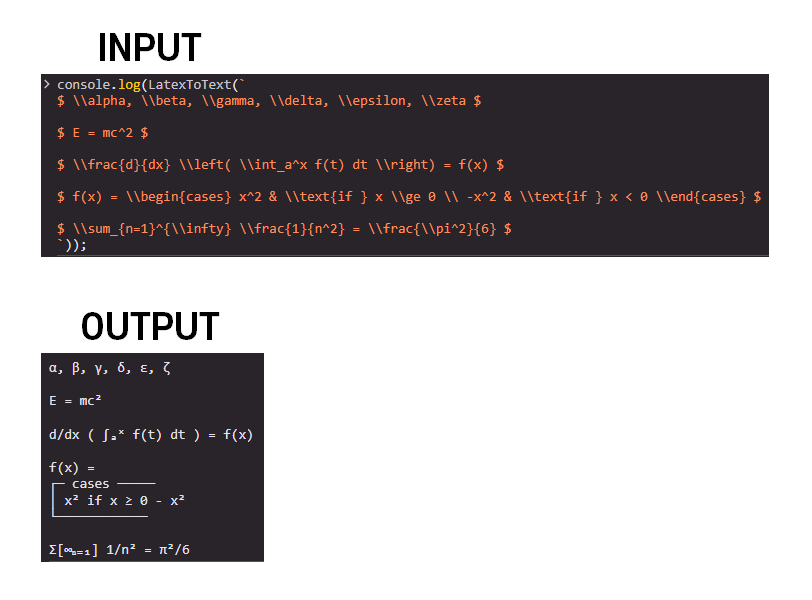
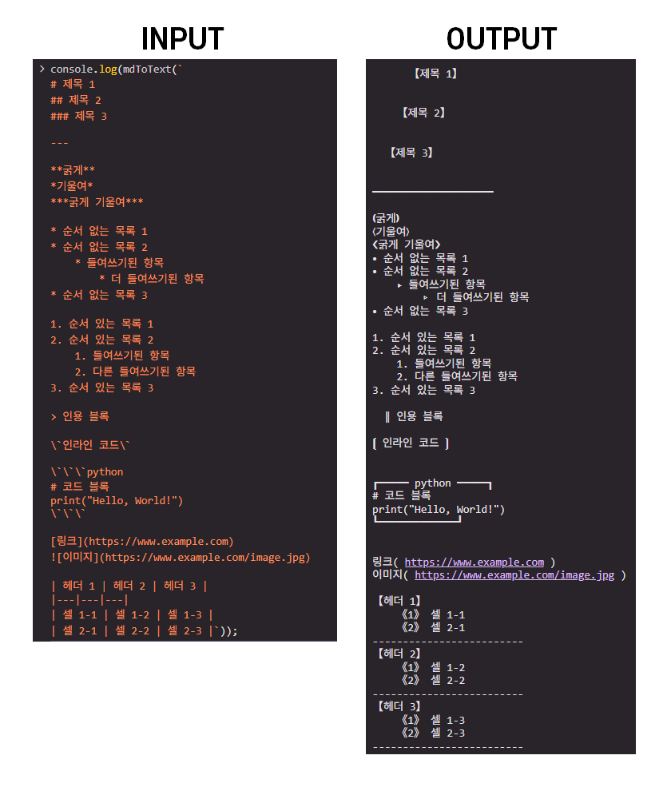

# To Plain Text
MarkDown, LaTeX 수식 표기를 지원하지 않는 환경에서 높은 가독성을 유지하기 위한 함수입니다.

## 1. 소개

### 1.1 목적 및 기능

카카오톡 봇과 같이 MarkDown이나 LaTeX 문법으로 작성한 내용도 일반 텍스트로 출력되는 환경이 있습니다. 이러한 환경에서는 오히려 가독성을 저해하기 때문에, 이를 해결하기 위해 만든 함수입니다.
단순히 평문으로 바꾸는 것이 아닌 적절한 강조를 유지합니다.

### 1.2 주요 특징

*   **LaTeX 변환 (`LaTeX.js`)**:
    *   다양한 LaTeX 수학 기호, 연산자, 그리스 문자, 화살표 등을 유니코드 문자로 변환합니다.
    *   위 첨자(`^`), 아래 첨자(`_`)를 해당 유니코드 문자로 변환합니다.
    *   분수(`\frac`), 제곱근(`\sqrt`), 합계(`\sum`), 곱(`\prod`), 적분(`\int`) 등 주요 수학 구조를 텍스트 형식으로 표현합니다.
    *   수학 폰트 (`\mathbf`, `\mathbb`, `\mathcal`, `\mathfrak`) 및 장식 기호 (`\overline`, `\vec` 등)를 지원합니다.
    *   `align`, `gather`, `cases`와 같은 수학 환경을 적절히 파싱하여 줄 바꿈과 함께 가독성 있게 표시합니다.
    *   `\text{}` 내의 텍스트는 그대로 유지하고, `\textcolor{}`는 내용만 표시합니다.
    *   `\boxed{}`는 내용을 `[ ]`로 감싸 강조합니다.
*   **Markdown 변환 (`markdown.js`)**:
    *   제목 (`#`), 목록 (`-`, `*`), 인용 (`>`)을 들여쓰기와 특수 문자로 표현합니다.
    *   굵게 (`**text**`, `__text__`), 기울임 (`*text*`, `_text_`), 굵게+기울임 (`***text***`), 취소선 (`~~text~~`)을 특수 괄호나 문자로 강조합니다.
    *   인라인 코드 (`code`) 및 코드 블록 (```code```)을 구분하여 표시합니다.
    *   수평선 (`---`, `***`)을 선 문자로 대체합니다.
    *   이미지 (``)와 링크 (`[text](url)`)를 "텍스트( URL )" 또는 URL 형태로 표시합니다.
    *   Markdown 표를 각 열의 내용을 목록화하여 가독성 있는 형태로 변환합니다.
*   **공통**:
    *   변환 과정에서 코드 블록 내용은 보존합니다.
    *   일반 텍스트 환경에서도 원본 문서의 구조와 강조를 최대한 유지하여 가독성을 높입니다.

## 2. 사용 방법

이 함수들은 JavaScript 환경에서 사용할 수 있습니다. 각 파일을 로드한 후, 제공되는 메인 함수를 호출하여 변환을 수행합니다.

1.  **LaTeX 문자열을 평문으로 변환 (`LaTeX.js`)**

    *변환 예시:*
     

2.  **Markdown 문자열을 평문으로 변환 (`markdown.js`)**

    *변환 예시:*
     

각 함수는 입력된 문자열을 처리하여 가독성이 향상된 일반 텍스트 문자열을 반환합니다.

## 3. 문제 해결

### 3.1 오류 보고

오류가 발생하면 다음 정보를 첨부하여 문의해주세요.

*   오류 내용:
*   사용 환경:
*   캡처 화면, 오류 메시지, 버전:

## 4. 기타 정보

### 4.1 라이선스

이 함수는 CC BY-NC 4.0 License 라이선스를 따릅니다.

### 4.2 개발자 정보

* 개발자: Hehee
* 이메일: gyugyum@gmail.com